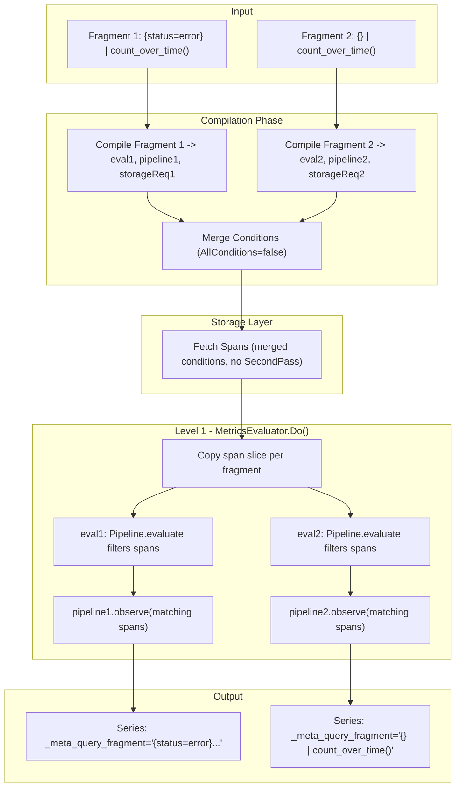
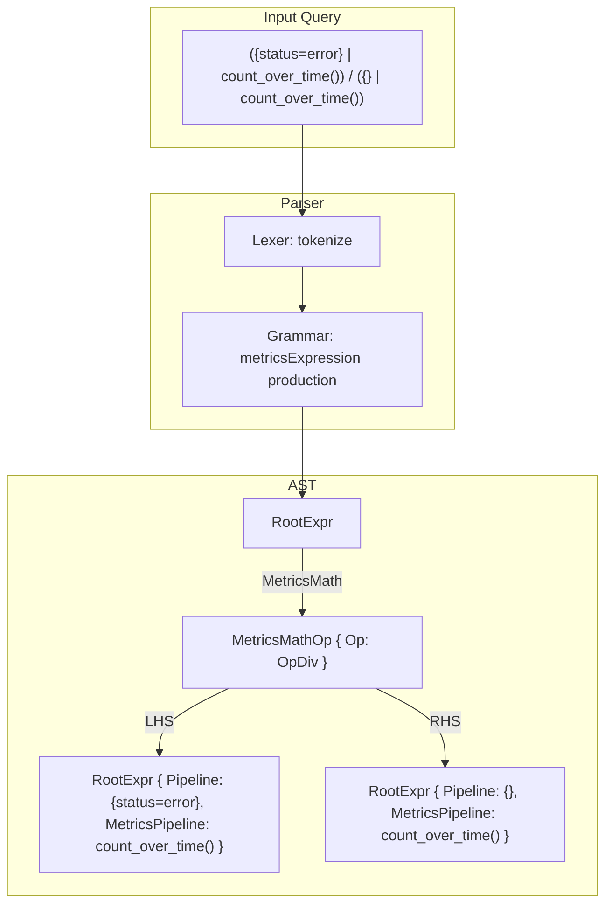
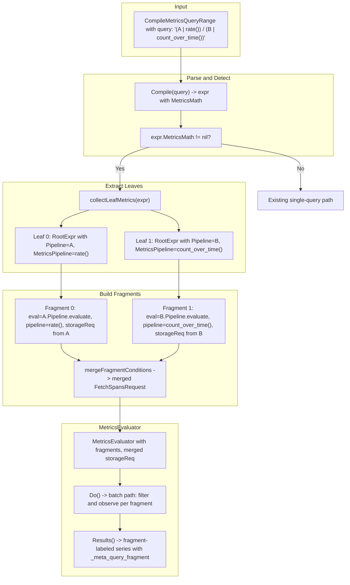
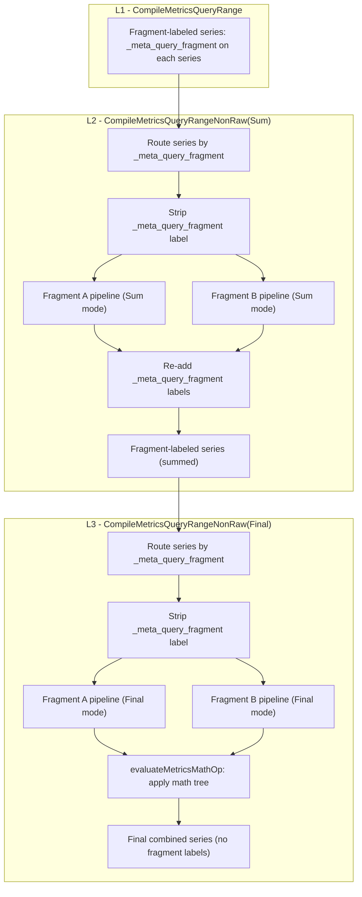

# Batch Metrics Queries Support

## Background

TraceQL metrics queries like `({status=error} | count_over_time()) / ({} | count_over_time())` require dividing into sub-queries that are evaluated separately but should be fetched in a single storage pass for efficiency.

The goal is to:

1. Fetch spans matching **any** sub-query in one pass (L1)
2. Filter and route each span to the pipeline(s) it matches using `Pipeline.evaluate`
3. Label output series with `_meta_query_fragment` to identify their source query
4. Pass series separately to higher levels (L2, L3) for aggregation

## Status

All items implemented and tested.

- [x] **extend-span-interface**: Add `MatchedGroups() uint64` and `SetMatchedGroups(uint64)` methods to `traceql.Span` interface in storage.go
- [x] **implement-vparquet5**: Add `matchedGroups` field to vparquet5 span struct, implement interface methods, and update `putSpan()` to reset the field
- [x] **implement-vparquet4**: Add stub implementations of `MatchedGroups()`/`SetMatchedGroups()` to vparquet4 span (return 0, no-op)
- [x] **implement-vparquet3**: Add stub implementations of `MatchedGroups()`/`SetMatchedGroups()` to vparquet3 span (return 0, no-op)
- [x] **define-types**: Define `QueryFragment` struct, `internalLabelQueryFragment` constant
- [x] **extend-evaluator**: Add `fragments` field to `MetricsEvaluator` struct
- [x] **compile-batch**: Implement `CompileBatchMetricsQueryRange` with validation and condition merging
- [x] **modify-do**: Modify `Do()` to use each fragment's `eval` for filtering, then observe matching spans
- [x] **modify-results**: Modify `Results()` method to add `_meta_query_fragment` labels to output series
- [x] **add-tests**: Add test cases for batch query functionality in tempodb_metrics_test.go

## Architecture



### How filtering works

In the regular single-query metrics path, `Compile()` returns `eval = Pipeline.evaluate`, which is set as the `SecondPass` callback. `Pipeline.evaluate` iterates through the pipeline elements (e.g., `SpansetFilter`) and filters spans by executing the filter expression against each span. Only surviving spans reach `Do()` where `metricsPipeline.observe(s)` is called.

For batch mode, we cannot use a single SecondPass for multiple fragments since each has different filter conditions. Instead, filtering is done in `Do()`: for each fragment, we copy the span slice and run that fragment's `eval` function, which applies `Pipeline.evaluate` to filter spans. Only matching spans are observed by the fragment's metrics pipeline.

## Implementation

### 1. Extend Span Interface

In `pkg/traceql/storage.go`:

```go
type Span interface {
    // ... existing methods ...

    // MatchedGroups returns a bitmap of condition group indices this span matched.
    // Bit i is set if the span matched group i.
    // Returns 0 if not set or not supported by the storage implementation.
    MatchedGroups() uint64

    // SetMatchedGroups sets the bitmap of condition group indices this span matched.
    // May be a no-op for storage implementations that don't support it.
    SetMatchedGroups(groups uint64)
}
```

**Note:** `MatchedGroups`/`SetMatchedGroups` are part of the Span interface for future use (e.g., tagging spans in SecondPass for more efficient routing). They are not currently used by the batch query evaluation path, which uses `Pipeline.evaluate` directly.

### 2. Implement in vparquet5

In `tempodb/encoding/vparquet5/block_traceql.go`:

```go
type span struct {
    // ... existing fields ...
    matchedGroups uint64
}

func (s *span) MatchedGroups() uint64    { return s.matchedGroups }
func (s *span) SetMatchedGroups(g uint64) { s.matchedGroups = g }
```

`putSpan()` resets `s.matchedGroups = 0` to prevent stale data when spans are reused from the pool.

### 3. Stub Implementations for vparquet3/4

```go
func (s *span) MatchedGroups() uint64     { return 0 }
func (s *span) SetMatchedGroups(_ uint64) {}
```

### 4. New Types in engine_metrics.go

```go
const (
    internalLabelQueryFragment = "_meta_query_fragment"
    maxBatchFragments          = 64  // Limited by uint64 bitmap
)

type QueryFragment struct {
    ID         string             // Query string, used as label value
    Index      int                // Bit position in MatchedGroups bitmap (0-63)
    eval       SpansetFilterFunc  // Pipeline.evaluate from Compile()
    pipeline   firstStageElement  // Metrics aggregation pipeline
    storageReq *FetchSpansRequest // Original conditions for this fragment
}
```

### 5. Extend MetricsEvaluator

```go
type MetricsEvaluator struct {
    // ... existing fields ...

    // fragments holds multiple query fragments for batch processing.
    // When nil or empty, single-query mode is used (backward compatible).
    fragments []QueryFragment
}
```

### 6. CompileBatchMetricsQueryRange

Each query is compiled independently via `Compile()`, producing its own `eval` function, metrics pipeline, and storage request. Conditions from all fragments are merged with OR logic into a single `FetchSpansRequest` for efficient storage access.

```go
func (e *Engine) CompileBatchMetricsQueryRange(
    req *tempopb.QueryRangeRequest,
    queries []string,
    exemplars int,
    timeOverlapCutoff float64,
    allowUnsafeQueryHints bool,
) (*MetricsEvaluator, error) {
    // ... validate request params and fragment count ...

    fragments := make([]QueryFragment, len(queries))
    for i, q := range queries {
        _, eval, metricsPipeline, _, storageReq, err := Compile(q)
        // ... validate metrics query ...

        metricsPipeline.init(req, AggregateModeRaw)

        fragments[i] = QueryFragment{
            ID: q, Index: i,
            eval: eval, pipeline: metricsPipeline, storageReq: storageReq,
        }
    }

    mergedReq := mergeFragmentConditions(fragments)

    me := &MetricsEvaluator{
        storageReq: mergedReq, fragments: fragments,
        // ... other fields ...
    }

    // Add span start time for time filtering in Do()
    if !mergedReq.HasAttribute(IntrinsicSpanStartTimeAttribute) {
        mergedReq.SecondPassConditions = append(mergedReq.SecondPassConditions,
            Condition{Attribute: IntrinsicSpanStartTimeAttribute})
    }

    return me, nil
}
```

No `SecondPass` callback is set -- filtering is done in `Do()` via each fragment's `eval`.

### 7. Condition Merging

```go
func mergeFragmentConditions(fragments []QueryFragment) *FetchSpansRequest {
    merged := &FetchSpansRequest{
        AllConditions: false,  // OR logic - match any fragment
    }
    // Deduplicate conditions from all fragments
    // ...
    return merged
}
```

### 8. Do() Method -- Batch Path

For batch mode, `Do()` iterates fragments instead of individual spans:

```go
if len(e.fragments) > 0 {
    // Save original spans since Pipeline.evaluate modifies the spanset in-place
    originalSpans := ss.Spans

    for j := range e.fragments {
        // Copy the span slice so eval can safely modify it
        ss.Spans = make([]Span, len(originalSpans))
        copy(ss.Spans, originalSpans)

        filtered, err := e.fragments[j].eval([]*Spanset{ss})
        if err != nil {
            continue
        }

        for _, fss := range filtered {
            for _, s := range fss.Spans {
                if e.checkTime {
                    st := s.StartTimeUnixNanos()
                    if st <= e.start || st > e.end {
                        continue
                    }
                }

                validSpansCount++
                e.fragments[j].pipeline.observe(s)
            }
        }
    }

    // Restore original spans for release
    ss.Spans = originalSpans
}
```

This reuses the same `Pipeline.evaluate` code path that single-query mode uses in its `SecondPass`, ensuring filtering behavior is identical.

### 9. Results() Method

```go
if len(e.fragments) > 0 {
    combined := make(SeriesSet)
    for _, frag := range e.fragments {
        fragLabel := Label{
            Name:  internalLabelQueryFragment,
            Value: NewStaticString(frag.ID),
        }
        for _, series := range frag.pipeline.result(multiplier) {
            series.Labels = series.Labels.Add(fragLabel)
            newKey := series.Labels.MapKey()
            combined[newKey] = series
        }
    }
    return combined
}
```

## Files Modified

| File | Changes |
|------|---------|
| `pkg/traceql/storage.go` | Add `MatchedGroups()` and `SetMatchedGroups()` to Span interface |
| `tempodb/encoding/vparquet5/block_traceql.go` | Add `matchedGroups` field, implement methods, update `putSpan()` reset |
| `tempodb/encoding/vparquet4/block_traceql.go` | Add stub implementations (return 0, no-op) |
| `tempodb/encoding/vparquet3/block_traceql.go` | Add stub implementations (return 0, no-op) |
| `pkg/traceql/engine_metrics.go` | `QueryFragment`, `CompileBatchMetricsQueryRange`, condition merging, modified `Do()`/`Results()`/`Length()` |
| `pkg/traceql/ast_test.go` | Add `MatchedGroups`/`SetMatchedGroups` stubs to `mockSpan` |
| `pkg/traceqlmetrics/mocks.go` | Add `MatchedGroups`/`SetMatchedGroups` stubs to `mockSpan` |
| `tempodb/tempodb_metrics_test.go` | `TestTempoDBBatchQueryRange`, `TestTempoDBBatchQueryRangeFallback` |

## Testing

### TestTempoDBBatchQueryRange (vparquet5)

- **basic_batch_query**: Two fragments (`{.service.name="even"} | count_over_time()` and `{} | count_over_time()`). Verifies `_meta_query_fragment` labels present, even fragment counts 25 spans, all fragment counts 50 spans.
- **overlapping_matches**: Three fragments (even, odd, all). Verifies even=25, odd=25, all=50, and even+odd=total.
- **validation_errors**: Empty queries, non-metrics queries, invalid syntax all return appropriate errors.

### TestTempoDBBatchQueryRangeFallback (vparquet4)

Verifies batch queries produce correct results with vparquet4 storage (which has stub `MatchedGroups`). Filtering still works correctly because it is done by `Pipeline.evaluate` in `Do()`, not via the bitmap.

## Backward Compatibility

- Existing `CompileMetricsQueryRange()` works unchanged
- Single-query mode remains the default in `Do()`, `Results()`, `Length()`
- No changes to protobuf or API contracts
- `MatchedGroups`/`SetMatchedGroups` on the Span interface are additive (stubs in vparquet3/4)

## Edge Cases Handled

1. **Span matches no fragments**: Not observed by any pipeline -- normal behavior.
2. **Span matches multiple fragments**: Observed by each matching pipeline independently (each fragment's `eval` runs on a fresh copy of the span slice).
3. **Empty fragment list**: Returns error from `CompileBatchMetricsQueryRange`.
4. **Span pool reuse (vparquet5)**: `putSpan()` clears `matchedGroups` to prevent stale data.
5. **Pipeline.evaluate modifies spanset in-place**: Handled by copying the span slice before each fragment's `eval` and restoring afterwards.

## Future Enhancements (Out of Scope)

1. Move filtering to SecondPass using `MatchedGroups` bitmap for better performance (avoids span slice copy per fragment in `Do()`)
2. Support for structural operators in batch mode (requires different architecture)
3. Automatic query optimization (detecting common subexpressions)
4. More than 64 fragments (use `[]uint64` or different data structure)
5. Exemplar support in batch mode

---

# Metrics Math Operations -- AST and Parser

## Background

To support expressions like `({status=error} | count_over_time()) / ({} | count_over_time())`, the TraceQL parser and AST must be extended to handle binary math operations (`+`, `-`, `*`, `/`) between metrics queries.

This builds on the batch metrics infrastructure above: the AST/parser produces a tree of math operations where each leaf is a metrics query. The evaluation layer (future work) will extract the leaves, compile them as batch fragments, execute them via `CompileBatchMetricsQueryRange`, and apply the math on the resulting time series.

## Status

All items implemented and tested.

- [x] **ast-node**: Add `MetricsMathOp` struct and `RootExpr.MetricsMath` field to `ast.go`
- [x] **root-helpers**: Update `NeedsFullTrace()` and `IsNoop()` on `RootExpr` to handle `MetricsMath`
- [x] **grammar**: Add `metricsExpression` production, union type, and update `root` rule in `expr.y`
- [x] **regenerate**: Regenerate `expr.y.go` with `goyacc`
- [x] **stringer**: Add `MetricsMathOp.String()`, `metricsOperandString()`, update `RootExpr.String()`
- [x] **validate**: Add `MetricsMathOp.validate()`, update `RootExpr.validate()`
- [x] **conditions**: Add `MetricsMathOp.extractConditions()`, update `RootExpr.extractConditions()`
- [x] **parse-tests**: Add parse test cases for metrics math expressions

## Architecture



### Key design decisions

- **`MetricsMathOp` uses `*RootExpr` for LHS/RHS**: Each operand is a `*RootExpr` where either `MetricsPipeline != nil` (leaf metrics query) or `MetricsMath != nil` (nested math operation). This enables arbitrary nesting like `(A / B) + (C / D)`.
- **Leaf metrics queries must be parenthesized**: The grammar requires `(spansetPipeline | metricsAggregation)` with explicit parens to avoid ambiguity with existing productions. Non-parenthesized `{} | count_over_time()` still uses the existing `root` production.
- **No grammar conflicts**: `metricsAggregation` start tokens (`RATE`, `COUNT_OVER_TIME`, etc.) are disjoint from `spansetExpression` start tokens (`OPEN_BRACE`, `OPEN_PARENS`), so the parser can unambiguously decide the path after `spansetPipeline PIPE`.
- **Operator precedence**: Uses existing `%left` precedence for `ADD`/`SUB` and `MUL`/`DIV`, so `*`/`/` bind tighter than `+`/`-`.

## Implementation

### 1. AST Node (`pkg/traceql/ast.go`)

```go
type MetricsMathOp struct {
    Op  Operator   // OpAdd, OpSub, OpMult, OpDiv
    LHS *RootExpr
    RHS *RootExpr
}
```

`RootExpr` gains a new field:

```go
type RootExpr struct {
    Pipeline           Pipeline
    MetricsPipeline    firstStageElement
    MetricsSecondStage secondStageElement
    MetricsMath        *MetricsMathOp
    Hints              *Hints
}
```

Constructor:

```go
func newRootExprWithMetricsMath(lhs *RootExpr, op Operator, rhs *RootExpr) *RootExpr {
    return &RootExpr{
        MetricsMath: &MetricsMathOp{Op: op, LHS: lhs, RHS: rhs},
    }
}
```

### 2. Grammar (`pkg/traceql/expr.y`)

New `metricsExpression` non-terminal:

```yacc
metricsExpression:
    OPEN_PARENS spansetPipeline PIPE metricsAggregation CLOSE_PARENS
        { $$ = newRootExprWithMetrics($2, $4) }
  | OPEN_PARENS metricsExpression CLOSE_PARENS
        { $$ = $2 }
  | metricsExpression ADD metricsExpression
        { $$ = newRootExprWithMetricsMath($1, OpAdd, $3) }
  | metricsExpression SUB metricsExpression
        { $$ = newRootExprWithMetricsMath($1, OpSub, $3) }
  | metricsExpression MUL metricsExpression
        { $$ = newRootExprWithMetricsMath($1, OpMult, $3) }
  | metricsExpression DIV metricsExpression
        { $$ = newRootExprWithMetricsMath($1, OpDiv, $3) }
  ;
```

Added to `root`:

```yacc
root:
    ...existing rules...
  | metricsExpression  { yylex.(*lexer).expr = $1 }
  ;
```

### 3. String representation (`pkg/traceql/ast_stringer.go`)

Each leaf operand is wrapped in parentheses to ensure round-trip correctness:

```go
func metricsOperandString(r *RootExpr) string {
    if r.MetricsMath != nil {
        return "(" + r.MetricsMath.String() + ")"
    }
    return "(" + r.String() + ")"
}

func (m MetricsMathOp) String() string {
    return metricsOperandString(m.LHS) + " " + m.Op.String() + " " + metricsOperandString(m.RHS)
}
```

### 4. Validation (`pkg/traceql/ast_validate.go`)

Both sides must be metrics queries (either a leaf with `MetricsPipeline` or nested `MetricsMath`).

### 5. Condition extraction (`pkg/traceql/ast_conditions.go`)

Delegates to both sides, merging conditions from all leaf queries.

## Out of scope

- **Evaluation**: ~~`Compile()` on a math expression returns nil `MetricsPipeline`. Callers must detect `MetricsMath != nil` and use the batch path.~~ Now handled by `CompileMetricsQueryRange` (see next section).
- **`metricsSecondStage` on math expressions**: e.g., `({} | rate()) / ({} | count_over_time()) | topk(10)`
- **`POW` and `MOD` operators**: only `+`, `-`, `*`, `/` for now.

## Files Modified

- `pkg/traceql/ast.go` -- `MetricsMathOp` struct, `RootExpr.MetricsMath` field, constructor, `NeedsFullTrace()`, `IsNoop()`
- `pkg/traceql/expr.y` -- `metricsExpression` production, updated `root` rule, union type
- `pkg/traceql/expr.y.go` -- Regenerated
- `pkg/traceql/ast_stringer.go` -- `MetricsMathOp.String()`, `metricsOperandString()`, updated `RootExpr.String()`
- `pkg/traceql/ast_validate.go` -- `MetricsMathOp.validate()`, updated `RootExpr.validate()`
- `pkg/traceql/ast_conditions.go` -- `MetricsMathOp.extractConditions()`, updated `RootExpr.extractConditions()`
- `pkg/traceql/parse_test.go` -- `TestMetricsMath` test cases

---

# MetricsMath Support in CompileMetricsQueryRange (Level 1)

## Background

With the AST/parser supporting `MetricsMathOp` nodes and the batch fragment infrastructure in place, the next step is to make `CompileMetricsQueryRange` (the standard L1 entry point) transparently handle metrics math expressions like `({status=error} | count_over_time()) / ({} | count_over_time())`.

Previously, `CompileMetricsQueryRange` called `Compile()` and rejected queries where `MetricsPipeline == nil`. For MetricsMath expressions, `Compile()` returns nil `MetricsPipeline` because the top-level `RootExpr` has `MetricsMath` set instead of `MetricsPipeline`. Callers had to explicitly use `CompileBatchMetricsQueryRange` with pre-split query strings.

Now, `CompileMetricsQueryRange` detects `MetricsMath` on the parsed expression, extracts all leaf metrics queries from the math tree, and compiles them as batch fragments using the existing infrastructure. The output is fragment-labeled series (with `_meta_query_fragment` labels) ready for higher-level math aggregation.

## Status

All items implemented and tested.

- [x] **collect-leaves**: Add `collectLeafMetrics()` to traverse MetricsMathOp tree and return leaf `*RootExpr` nodes
- [x] **compile-helper**: Add `compileMetricsMathQueryRange()` private method that creates fragments from AST leaves
- [x] **modify-compile**: Modify `CompileMetricsQueryRange` to detect `MetricsMath` and branch to helper
- [x] **update-tests**: Update `TestTempoDBBatchQueryRange` and `TestTempoDBBatchQueryRangeFallback` to use `CompileMetricsQueryRange`

## Architecture



## Implementation

### 1. collectLeafMetrics (`pkg/traceql/engine_metrics.go`)

Recursively traverses the `MetricsMathOp` binary tree and collects all leaf `*RootExpr` nodes (those with `MetricsPipeline != nil`). Returns leaves in left-to-right order.

```go
func collectLeafMetrics(r *RootExpr) []*RootExpr {
    if r.MetricsMath != nil {
        return append(collectLeafMetrics(r.MetricsMath.LHS), collectLeafMetrics(r.MetricsMath.RHS)...)
    }
    if r.MetricsPipeline != nil {
        return []*RootExpr{r}
    }
    return nil
}
```

For `(A / B) + C`, this returns `[A, B, C]`.

### 2. compileMetricsMathQueryRange (`pkg/traceql/engine_metrics.go`)

Private method on `Engine` that takes a parsed `*RootExpr` with `MetricsMath` set and builds a `MetricsEvaluator` with fragments. This works from parsed AST leaf nodes instead of raw query strings (unlike `CompileBatchMetricsQueryRange`).

For each leaf:
- Creates a per-leaf `FetchSpansRequest` with `AllConditions: true` via `leaf.extractConditions()`
- Uses `leaf.Pipeline.evaluate` as the fragment's `eval` function (filters spans)
- Uses `leaf.MetricsPipeline` as the fragment's metrics pipeline (observes matching spans)
- Uses `leaf.String()` as the fragment ID (canonical string representation)

Conditions from all leaves are merged with OR logic via `mergeFragmentConditions()`. No `SecondPass` callback is set -- filtering happens in `Do()` via each fragment's `eval`, identical to the existing batch path.

### 3. CompileMetricsQueryRange modification (`pkg/traceql/engine_metrics.go`)

After `Compile(req.Query)` succeeds, a new branch checks `expr.MetricsMath != nil` and delegates to `compileMetricsMathQueryRange`. This is inserted before the existing `metricsPipeline == nil` check, so:

- MetricsMath expressions use the batch fragment path
- Regular metrics queries use the existing single-query path (unchanged)
- Non-metrics queries still return "not a metrics query"

### 4. Fragment ID format

Fragment IDs use `leaf.String()` which produces a canonical representation:

| Input query fragment             | `leaf.String()` output                       |
|----------------------------------|----------------------------------------------|
| `{ .service.name="even" } \| count_over_time()` | `{ .service.name = ` `` `even` `` ` } \| count_over_time()` |
| `{ } \| count_over_time()`       | `{ true } \| count_over_time()`              |

This differs from raw query strings (backtick quotes, spaces around `=`, `{}` becomes `{ true }`), but is deterministic and round-trip safe.

## Files Modified

| File | Changes |
|------|---------|
| `pkg/traceql/engine_metrics.go` | `collectLeafMetrics()`, `compileMetricsMathQueryRange()`, modified `CompileMetricsQueryRange()` |
| `tempodb/tempodb_metrics_test.go` | Updated `TestTempoDBBatchQueryRange` and `TestTempoDBBatchQueryRangeFallback` to use `CompileMetricsQueryRange` with math expression queries |

## Testing

### TestTempoDBBatchQueryRange (updated)

Tests now use `CompileMetricsQueryRange` with full math expression queries instead of `CompileBatchMetricsQueryRange` with separate query strings:

- **basic_batch_query**: Query `({ .service.name="even" } | count_over_time()) / ({ } | count_over_time())`. Verifies 2 series with `_meta_query_fragment` labels, even=25, all=50.
- **overlapping_matches**: Query with 3 leaves via `((even) + (odd)) + (all)`. Verifies even=25, odd=25, all=50, even+odd=total.
- **validation_errors**: Non-metrics query returns "not a metrics query", invalid syntax returns compile error.

### TestTempoDBBatchQueryRangeFallback (updated)

Uses `CompileMetricsQueryRange` with math expression query against vparquet4 storage. Verifies correct results with fallback evaluation (vparquet4 has stub `MatchedGroups`).

## Backward Compatibility

- `CompileBatchMetricsQueryRange` remains available for callers that provide queries as separate strings
- Existing `CompileMetricsQueryRange` single-query behavior is unchanged
- `Do()`, `Results()`, `Length()` batch paths are reused without modification
- No changes to protobuf, storage layer, or API contracts

## Future Enhancements (Out of Scope)

1. ~~Apply math operations on fragment results at L2/L3 (frontend aggregation)~~ Now handled (see next section).
2. Store `MetricsMathOp` tree in `MetricsEvaluator` for higher-level evaluation
3. `metricsSecondStage` on math expressions (e.g., `({} | rate()) / ({} | count_over_time()) | topk(10)`)

---

# MetricsMath Support in CompileMetricsQueryRangeNonRaw (L2/L3)

## Background

With L1 (`CompileMetricsQueryRange`) producing fragment-labeled series for MetricsMath queries, the next step is making `CompileMetricsQueryRangeNonRaw` handle these at L2 and L3:

- **L2 (AggregateModeSum)**: Route incoming fragment-labeled series to per-fragment pipelines, aggregate (sum) within each fragment, return fragment-labeled results.
- **L3 (AggregateModeFinal)**: Same routing and aggregation, then apply the math tree on fragment results to produce the final combined series (without `_meta_query_fragment` labels).

The full pipeline for a query like `({status=error} | count_over_time()) / ({} | count_over_time())`:

```
L1: two fragment series (error=N, all=M)
L2: summed from multiple sources (error=2N, all=2M), still fragment-labeled
L3: apply division: 2N/2M -> final series (no fragment labels)
```

## Status

All items implemented and tested.

- [x] **math-eval-funcs**: Add `applyMetricsOp`, `applySeriesSetOp`, `evaluateMetricsMathOp`, `evaluateMetricsMathExpr`, `stripFragmentLabel`
- [x] **extend-frontend-evaluator**: Add `fragmentPipelines` and `metricsMath` fields to `MetricsFrontendEvaluator`
- [x] **compile-nonraw-helper**: Add `compileMetricsMathNonRaw` helper method
- [x] **modify-compile-nonraw**: Modify `CompileMetricsQueryRangeNonRaw` to detect MetricsMath and branch
- [x] **modify-observe-results-length**: Modify `ObserveSeries`, `Results`, and `Length` for MetricsMath
- [x] **update-tests**: Update `TestTempoDBBatchQueryRange` with L2 and L3 assertions

## Architecture



## Implementation

### 1. Math evaluation functions (`pkg/traceql/engine_metrics.go`)

- `applyMetricsOp(op, a, b)` -- scalar math with div-by-zero handling (returns NaN)
- `applySeriesSetOp(op, lhs, rhs)` -- inner-join two SeriesSets by `SeriesMapKey`, element-wise on Values
- `evaluateMetricsMathOp(math, fragmentResults)` -- recursive math tree evaluation
- `evaluateMetricsMathExpr(expr, fragmentResults)` -- leaf lookup or nested math recurse
- `stripFragmentLabel(ts)` -- strip `_meta_query_fragment` from proto TimeSeries, return (fragmentID, strippedTS)

### 2. MetricsFrontendEvaluator extensions

```go
type MetricsFrontendEvaluator struct {
    // ... existing fields ...
    fragmentPipelines map[string]firstStageElement  // fragment ID -> pipeline
    metricsMath       *MetricsMathOp                // math tree, set only in Final mode
}
```

### 3. compileMetricsMathNonRaw helper

Extracts leaves from MetricsMathOp tree, creates per-fragment pipeline initialized with the given mode (Sum or Final), stores `metricsMath` only when mode is Final.

### 4. CompileMetricsQueryRangeNonRaw modification

Captures `expr` from `Compile()`, detects `expr.MetricsMath != nil`, delegates to `compileMetricsMathNonRaw`.

### 5. ObserveSeries modification

Routes incoming series to fragment pipelines based on `_meta_query_fragment` label value. Strips the label before feeding to pipelines. Batches series per fragment for efficiency.

### 6. Results modification

- **Sum mode** (`metricsMath == nil`): re-add `_meta_query_fragment` labels to each fragment's results
- **Final mode** (`metricsMath != nil`): call `evaluateMetricsMathOp` to apply math tree, return combined series

## Files Modified

| File | Changes |
|------|---------|
| `pkg/traceql/engine_metrics.go` | Math eval functions, `MetricsFrontendEvaluator` extensions, `compileMetricsMathNonRaw`, modified `CompileMetricsQueryRangeNonRaw`/`ObserveSeries`/`Results`/`Length` |
| `tempodb/tempodb_metrics_test.go` | Updated `TestTempoDBBatchQueryRange` with L2 and L3 assertions |

## Testing

### TestTempoDBBatchQueryRange (updated)

- **basic_batch_query** (`even / all`): L1: even=25, all=50. L2 (observed twice): even=50, all=100. L3: 50/100 = 0.5 (single unlabeled series).
- **overlapping_matches** (`(even + odd) + all`): L1: even=25, odd=25, all=50. L2: even=50, odd=50, all=100. L3: (50+50)+100 = 200 (single unlabeled series).

## Backward Compatibility

- Existing `CompileMetricsQueryRangeNonRaw` single-query behavior is unchanged
- `ObserveSeries`, `Results`, `Length` fall through to existing paths when `fragmentPipelines` is empty
- No changes to protobuf, storage layer, or API contracts
