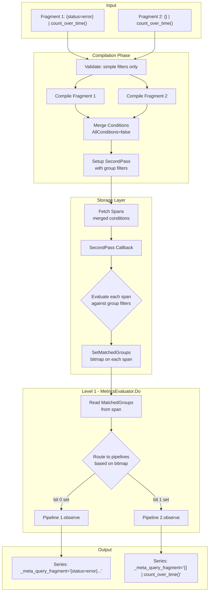

# Batch Metrics Queries Support

## Background

TraceQL metrics queries like `({status=error} | count_over_time()) / ({} | count_over_time())` require dividing into sub-queries that are evaluated separately but should be fetched in a single storage pass for efficiency.

The goal is to:

1. Fetch spans matching **any** sub-query in one pass (L1)
2. Route each span to the pipeline(s) it matches
3. Label output series with `_meta_query_fragment` to identify their source query
4. Pass series separately to higher levels (L2, L3) for aggregation

## Todos

- [ ] **extend-span-interface**: Add `MatchedGroups() uint64` and `SetMatchedGroups(uint64)` methods to `traceql.Span` interface in storage.go
- [ ] **implement-vparquet5**: Add `matchedGroups` field to vparquet5 span struct, implement interface methods, and update `putSpan()` to reset the field
- [ ] **implement-vparquet4**: Add stub implementations of `MatchedGroups()`/`SetMatchedGroups()` to vparquet4 span (return 0, no-op)
- [ ] **implement-vparquet3**: Add stub implementations of `MatchedGroups()`/`SetMatchedGroups()` to vparquet3 span (return 0, no-op)
- [ ] **define-types**: Define `QueryFragment` struct with Index field, `internalLabelQueryFragment` constant
- [ ] **extend-evaluator**: Add `fragments` field to `MetricsEvaluator` struct
- [ ] **compile-batch**: Implement `CompileBatchMetricsQueryRange` with validation, condition merging, and SecondPass setup
- [ ] **modify-do**: Modify `Do()` method to read `MatchedGroups()` and route spans to matching fragment pipelines
- [ ] **modify-results**: Modify `Results()` method to add `_meta_query_fragment` labels to output series
- [ ] **add-tests**: Add test cases for batch query functionality in tempodb_metrics_test.go

## Scope and Limitations

**Supported queries (initial scope):**

- Simple filter queries: `{attr=value} | count_over_time()`, `{} | rate()`, etc.
- Queries where the filter is a single `SpansetFilter` element in the Pipeline

**Not supported in batch mode:**

- Complex structural queries: `{A} >> {B} | count_over_time()` (descendant)
- Queries with multiple pipeline stages before the metrics aggregate
- These will return an error from `CompileBatchMetricsQueryRange`

**Rationale:** Structural operators like `>>`, `<<`, `~` require evaluating relationships between spans, not individual span matching. Supporting these would require fundamentally different architecture.

## Architecture



## Implementation

### 1. Extend Span Interface

In `pkg/traceql/storage.go`:

```go
type Span interface {
    // ... existing methods ...
    
    // MatchedGroups returns a bitmap of condition group indices this span matched.
    // Bit i is set if the span matched group i.
    // Returns 0 if not set or not supported by the storage implementation.
    MatchedGroups() uint64
    
    // SetMatchedGroups sets the bitmap of condition group indices this span matched.
    // May be a no-op for storage implementations that don't support it.
    SetMatchedGroups(groups uint64)
}
```

**Design choice: uint64 bitmap instead of []int slice**

- Avoids allocation per span (critical for hot path)
- Supports up to 64 fragments (sufficient for practical use)
- Zero value (0) means "not set" - triggers fallback evaluation

### 2. Implement in vparquet5

In `tempodb/encoding/vparquet5/block_traceql.go`:

```go
type span struct {
    // ... existing fields ...
    
    // matchedGroups is a bitmap of condition group indices this span matched.
    // Set by the SecondPass callback during batch query evaluation.
    matchedGroups uint64
}

func (s *span) MatchedGroups() uint64 {
    return s.matchedGroups
}

func (s *span) SetMatchedGroups(groups uint64) {
    s.matchedGroups = groups
}
```

**Critical: Update putSpan() to reset the field:**

```go
func putSpan(s *span) {
    // ... existing reset code ...
    s.matchedGroups = 0  // ADD THIS LINE
    
    spanPool.Put(s)
}
```

### 3. Stub Implementations for vparquet3/4

In `tempodb/encoding/vparquet4/block_traceql.go` and `tempodb/encoding/vparquet3/block_traceql.go`:

```go
func (s *span) MatchedGroups() uint64 {
    return 0  // Not supported - triggers fallback in Do()
}

func (s *span) SetMatchedGroups(groups uint64) {
    // no-op for older parquet versions
}
```

### 4. New Types in engine_metrics.go

In `pkg/traceql/engine_metrics.go`:

```go
const (
    internalLabelQueryFragment = "_meta_query_fragment"
    maxBatchFragments          = 64  // Limited by uint64 bitmap
)

// QueryFragment represents a single sub-query within a batch query.
type QueryFragment struct {
    // ID uniquely identifies this fragment (typically the query string)
    ID string
    
    // Index is the bit position in the MatchedGroups bitmap (0-63)
    Index int
    
    // filter is the compiled filter expression to check if a span matches.
    // This is the SpansetFilter.Expression from the query's Pipeline.
    filter FieldExpression
    
    // pipeline is the metrics aggregation pipeline for this fragment
    pipeline firstStageElement
    
    // storageReq contains the original conditions for this fragment
    storageReq *FetchSpansRequest
}
```

### 5. Extend MetricsEvaluator

```go
type MetricsEvaluator struct {
    // ... existing fields ...
    
    // fragments holds multiple query fragments for batch processing.
    // When nil or empty, single-query mode is used (backward compatible).
    fragments []QueryFragment
}
```

### 6. Query Validation and Filter Extraction

```go
// extractSimpleFilter extracts the filter expression from a simple query.
// Returns the filter expression, or an error if the query is too complex for batch mode.
func extractSimpleFilter(expr *RootExpr) (FieldExpression, error) {
    if expr == nil || expr.Pipeline == nil {
        return nil, fmt.Errorf("nil expression")
    }
    
    // For batch mode, we only support pipelines with a single SpansetFilter
    // followed by the metrics aggregate (which is in MetricsPipeline, not Pipeline)
    elements := expr.Pipeline.Elements
    
    if len(elements) == 0 {
        // Empty pipeline like "{}" - matches all spans
        return Static{Type: TypeBoolean, B: true}, nil
    }
    
    if len(elements) > 1 {
        // Multiple elements means complex query (e.g., select, coalesce, structural ops)
        return nil, fmt.Errorf("batch mode only supports simple filter queries, got %d pipeline elements", len(elements))
    }
    
    // Check if the single element is a SpansetFilter
    filter, ok := elements[0].(*SpansetFilter)
    if !ok {
        // Could be SpansetOperation (structural), GroupOperation, etc.
        return nil, fmt.Errorf("batch mode only supports SpansetFilter, got %T", elements[0])
    }
    
    return filter.Expression, nil
}
```

### 7. CompileBatchMetricsQueryRange

```go
func (e *Engine) CompileBatchMetricsQueryRange(
    req *tempopb.QueryRangeRequest,
    queries []string,
    exemplars int,
    timeOverlapCutoff float64,
    allowUnsafeQueryHints bool,
) (*MetricsEvaluator, error) {
    // Validate fragment count
    if len(queries) == 0 {
        return nil, fmt.Errorf("at least one query required")
    }
    if len(queries) > maxBatchFragments {
        return nil, fmt.Errorf("too many queries: %d exceeds maximum %d", len(queries), maxBatchFragments)
    }
    
    // Compile each query and validate structure
    fragments := make([]QueryFragment, len(queries))
    for i, q := range queries {
        expr, _, metricsPipeline, _, storageReq, err := Compile(q)
        if err != nil {
            return nil, fmt.Errorf("compiling query %d (%q): %w", i, q, err)
        }
        if metricsPipeline == nil {
            return nil, fmt.Errorf("query %d (%q) is not a metrics query", i, q)
        }
        
        // Extract and validate filter
        filter, err := extractSimpleFilter(expr)
        if err != nil {
            return nil, fmt.Errorf("query %d (%q): %w", i, q, err)
        }
        
        metricsPipeline.init(req, AggregateModeRaw)
        
        fragments[i] = QueryFragment{
            ID:         q,
            Index:      i,
            filter:     filter,
            pipeline:   metricsPipeline,
            storageReq: storageReq,
        }
    }
    
    // Merge conditions from all fragments
    mergedReq := mergeFragmentConditions(fragments)
    
    // Create evaluator
    me := &MetricsEvaluator{
        storageReq:        mergedReq,
        fragments:         fragments,
        timeOverlapCutoff: timeOverlapCutoff,
        maxExemplars:      exemplars,
        exemplarMap:       make(map[string]struct{}, exemplars),
        start:             req.Start,
        end:               req.End,
        checkTime:         true,
    }
    
    // Setup SecondPass to evaluate group matching
    mergedReq.SecondPass = func(ss *Spanset) ([]*Spanset, error) {
        me.mtx.Lock()
        defer me.mtx.Unlock()
        
        // Evaluate each span against each fragment's filter
        for _, span := range ss.Spans {
            var matched uint64
            for _, frag := range fragments {
                if spanMatchesFilter(span, frag.filter) {
                    matched |= (1 << frag.Index)
                }
            }
            span.SetMatchedGroups(matched)
        }
        
        return []*Spanset{ss}, nil
    }
    
    // Add required conditions for time filtering
    if !mergedReq.HasAttribute(IntrinsicSpanStartTimeAttribute) {
        mergedReq.SecondPassConditions = append(mergedReq.SecondPassConditions, 
            Condition{Attribute: IntrinsicSpanStartTimeAttribute})
    }
    
    return me, nil
}

// spanMatchesFilter evaluates if a span matches a filter expression.
func spanMatchesFilter(span Span, filter FieldExpression) bool {
    if filter == nil {
        return true  // No filter means match all
    }
    result, err := filter.execute(span)
    if err != nil {
        return false  // On error, don't match
    }
    // Check if result is truthy
    if b, ok := result.Bool(); ok {
        return b
    }
    return false
}
```

### 8. Condition Merging

```go
func mergeFragmentConditions(fragments []QueryFragment) *FetchSpansRequest {
    merged := &FetchSpansRequest{
        AllConditions: false,  // OR logic - match any fragment
    }
    
    conditionKey := func(c Condition) string {
        // Create unique key for deduplication
        return fmt.Sprintf("%s:%v:%v", c.Attribute.String(), c.Op, c.Operands)
    }
    
    seenFirst := make(map[string]struct{})
    seenSecond := make(map[string]struct{})
    
    for _, f := range fragments {
        for _, c := range f.storageReq.Conditions {
            key := conditionKey(c)
            if _, ok := seenFirst[key]; !ok {
                seenFirst[key] = struct{}{}
                merged.Conditions = append(merged.Conditions, c)
            }
        }
        for _, c := range f.storageReq.SecondPassConditions {
            key := conditionKey(c)
            if _, ok := seenSecond[key]; !ok {
                seenSecond[key] = struct{}{}
                merged.SecondPassConditions = append(merged.SecondPassConditions, c)
            }
        }
    }
    
    return merged
}
```

### 9. Modify Do() Method

```go
func (e *MetricsEvaluator) Do(ctx context.Context, f SpansetFetcher, fetcherStart, fetcherEnd uint64, maxSeries int) error {
    // ... existing setup code ...
    
    for {
        ss, err := fetch.Results.Next(ctx)
        if err != nil {
            return err
        }
        if ss == nil {
            break
        }
        
        e.mtx.Lock()
        
        // ... existing sampler code ...
        
        for _, s := range ss.Spans {
            if e.checkTime {
                st := s.StartTimeUnixNanos()
                if st <= e.start || st > e.end {
                    continue
                }
            }
            
            // ... existing span sampler code ...
            
            if len(e.fragments) > 0 {
                // Batch mode: route based on MatchedGroups bitmap
                matched := s.MatchedGroups()
                
                if matched == 0 {
                    // Fallback: MatchedGroups not set (older storage or not in SecondPass)
                    // Evaluate filters directly
                    for i := range e.fragments {
                        if spanMatchesFilter(s, e.fragments[i].filter) {
                            e.fragments[i].pipeline.observe(s)
                        }
                    }
                } else {
                    // Use pre-computed bitmap
                    for i := range e.fragments {
                        if matched&(1<<i) != 0 {
                            e.fragments[i].pipeline.observe(s)
                        }
                    }
                }
            } else {
                // Single query mode (backward compatible)
                e.metricsPipeline.observe(s)
            }
            
            // ... existing exemplar code ...
        }
        
        // ... rest of method ...
    }
    
    // ... existing cleanup ...
}
```

### 10. Modify Results() Method

```go
func (e *MetricsEvaluator) Results() SeriesSet {
    e.mtx.Lock()
    defer e.mtx.Unlock()
    
    // Calculate multipliers
    spanMultiplier := 1.0
    if e.storageReq.SpanSampler != nil {
        spanMultiplier = e.storageReq.SpanSampler.FinalScalingFactor()
    }
    traceMultiplier := 1.0
    if e.storageReq.TraceSampler != nil {
        traceMultiplier = e.storageReq.TraceSampler.FinalScalingFactor()
    }
    multiplier := spanMultiplier * traceMultiplier
    
    if len(e.fragments) > 0 {
        // Batch mode: combine results from all fragments
        combined := make(SeriesSet)
        for _, frag := range e.fragments {
            fragLabel := Label{
                Name:  internalLabelQueryFragment,
                Value: NewStaticString(frag.ID),
            }
            for _, series := range frag.pipeline.result(multiplier) {
                // Add fragment label to each series
                series.Labels = series.Labels.Add(fragLabel)
                // Update key to include fragment label
                newKey := series.Labels.MapKey()
                combined[newKey] = series
            }
        }
        return combined
    }
    
    // Single query mode (backward compatible)
    return e.metricsPipeline.result(multiplier)
}
```

## Files to Modify

| File | Changes |
|------|---------|
| `pkg/traceql/storage.go` | Add `MatchedGroups()` and `SetMatchedGroups()` to Span interface |
| `tempodb/encoding/vparquet5/block_traceql.go` | Add `matchedGroups` field, implement methods, **update putSpan() reset** |
| `tempodb/encoding/vparquet4/block_traceql.go` | Add stub implementations (return 0, no-op) |
| `tempodb/encoding/vparquet3/block_traceql.go` | Add stub implementations (return 0, no-op) |
| `pkg/traceql/engine_metrics.go` | QueryFragment, CompileBatchMetricsQueryRange, validation, modified Do/Results |
| `tempodb/tempodb_metrics_test.go` | Test cases for batch queries |

## Testing Strategy

Add test case `TestTempoDBBatchQueryRange` to `tempodb_metrics_test.go`:

### Test 1: Basic Batch Query

```go
queries := []string{
    `{.service.name="even"} | count_over_time()`,
    `{} | count_over_time()`,
}
```

- Verify series with `_meta_query_fragment` labels
- Fragment 1: 25 spans (even service only)
- Fragment 2: 50 spans (all spans)

### Test 2: Overlapping Matches

- Verify that even-numbered spans appear in BOTH fragment series
- Count for fragment 1 (25) + count for fragment 2 (50) = 75 total observations

### Test 3: Validation Errors

```go
// Should fail: structural operator
queries := []string{`{A} >> {B} | count_over_time()`}
// Should fail: too many fragments (>64)
// Should fail: non-metrics query
```

### Test 4: Fallback Behavior

- Use vparquet4 block (stub MatchedGroups returns 0)
- Verify results are still correct via fallback evaluation

## Backward Compatibility

- Existing `CompileMetricsQueryRange()` works unchanged
- Single-query mode remains the default
- vparquet3/4 return 0 for MatchedGroups(), triggering fallback evaluation
- No changes to protobuf or API contracts

## Edge Cases Handled

1. **Span matches no fragments**: With proper query design (include `{}`), all spans match at least one fragment. If a span truly matches none, it's simply not observed by any pipeline.
2. **Span matches multiple fragments**: Expected - observed by all matching pipelines. Bitmap allows efficient multi-match.
3. **Storage doesn't support SetMatchedGroups (vparquet3/4)**: Do() detects `MatchedGroups() == 0` and falls back to direct filter evaluation.
4. **Empty fragment list**: Returns error from CompileBatchMetricsQueryRange.
5. **Complex queries**: Returns error with explanation from extractSimpleFilter.
6. **Span pool reuse**: putSpan() clears matchedGroups to prevent stale data.

## Future Enhancements (Out of Scope)

1. Support for structural operators in batch mode (requires different architecture)
2. Automatic query optimization (detecting common subexpressions)
3. More than 64 fragments (use []uint64 or different data structure)
