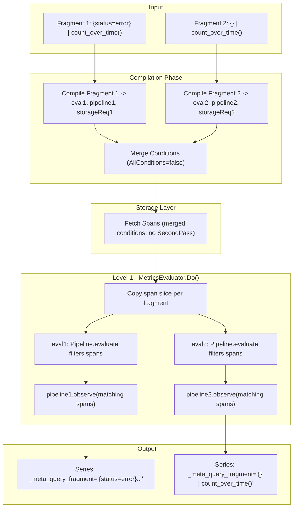

# Batch Metrics Queries Support

## Background

TraceQL metrics queries like `({status=error} | count_over_time()) / ({} | count_over_time())` require dividing into sub-queries that are evaluated separately but should be fetched in a single storage pass for efficiency.

The goal is to:

1. Fetch spans matching **any** sub-query in one pass (L1)
2. Filter and route each span to the pipeline(s) it matches using `Pipeline.evaluate`
3. Label output series with `_meta_query_fragment` to identify their source query
4. Pass series separately to higher levels (L2, L3) for aggregation

## Status

All items implemented and tested.

- [x] **extend-span-interface**: Add `MatchedGroups() uint64` and `SetMatchedGroups(uint64)` methods to `traceql.Span` interface in storage.go
- [x] **implement-vparquet5**: Add `matchedGroups` field to vparquet5 span struct, implement interface methods, and update `putSpan()` to reset the field
- [x] **implement-vparquet4**: Add stub implementations of `MatchedGroups()`/`SetMatchedGroups()` to vparquet4 span (return 0, no-op)
- [x] **implement-vparquet3**: Add stub implementations of `MatchedGroups()`/`SetMatchedGroups()` to vparquet3 span (return 0, no-op)
- [x] **define-types**: Define `QueryFragment` struct, `internalLabelQueryFragment` constant
- [x] **extend-evaluator**: Add `fragments` field to `MetricsEvaluator` struct
- [x] **compile-batch**: Implement `CompileBatchMetricsQueryRange` with validation and condition merging
- [x] **modify-do**: Modify `Do()` to use each fragment's `eval` for filtering, then observe matching spans
- [x] **modify-results**: Modify `Results()` method to add `_meta_query_fragment` labels to output series
- [x] **add-tests**: Add test cases for batch query functionality in tempodb_metrics_test.go

## Architecture



### How filtering works

In the regular single-query metrics path, `Compile()` returns `eval = Pipeline.evaluate`, which is set as the `SecondPass` callback. `Pipeline.evaluate` iterates through the pipeline elements (e.g., `SpansetFilter`) and filters spans by executing the filter expression against each span. Only surviving spans reach `Do()` where `metricsPipeline.observe(s)` is called.

For batch mode, we cannot use a single SecondPass for multiple fragments since each has different filter conditions. Instead, filtering is done in `Do()`: for each fragment, we copy the span slice and run that fragment's `eval` function, which applies `Pipeline.evaluate` to filter spans. Only matching spans are observed by the fragment's metrics pipeline.

## Implementation

### 1. Extend Span Interface

In `pkg/traceql/storage.go`:

```go
type Span interface {
    // ... existing methods ...

    // MatchedGroups returns a bitmap of condition group indices this span matched.
    // Bit i is set if the span matched group i.
    // Returns 0 if not set or not supported by the storage implementation.
    MatchedGroups() uint64

    // SetMatchedGroups sets the bitmap of condition group indices this span matched.
    // May be a no-op for storage implementations that don't support it.
    SetMatchedGroups(groups uint64)
}
```

**Note:** `MatchedGroups`/`SetMatchedGroups` are part of the Span interface for future use (e.g., tagging spans in SecondPass for more efficient routing). They are not currently used by the batch query evaluation path, which uses `Pipeline.evaluate` directly.

### 2. Implement in vparquet5

In `tempodb/encoding/vparquet5/block_traceql.go`:

```go
type span struct {
    // ... existing fields ...
    matchedGroups uint64
}

func (s *span) MatchedGroups() uint64    { return s.matchedGroups }
func (s *span) SetMatchedGroups(g uint64) { s.matchedGroups = g }
```

`putSpan()` resets `s.matchedGroups = 0` to prevent stale data when spans are reused from the pool.

### 3. Stub Implementations for vparquet3/4

```go
func (s *span) MatchedGroups() uint64     { return 0 }
func (s *span) SetMatchedGroups(_ uint64) {}
```

### 4. New Types in engine_metrics.go

```go
const (
    internalLabelQueryFragment = "_meta_query_fragment"
    maxBatchFragments          = 64  // Limited by uint64 bitmap
)

type QueryFragment struct {
    ID         string             // Query string, used as label value
    Index      int                // Bit position in MatchedGroups bitmap (0-63)
    eval       SpansetFilterFunc  // Pipeline.evaluate from Compile()
    pipeline   firstStageElement  // Metrics aggregation pipeline
    storageReq *FetchSpansRequest // Original conditions for this fragment
}
```

### 5. Extend MetricsEvaluator

```go
type MetricsEvaluator struct {
    // ... existing fields ...

    // fragments holds multiple query fragments for batch processing.
    // When nil or empty, single-query mode is used (backward compatible).
    fragments []QueryFragment
}
```

### 6. CompileBatchMetricsQueryRange

Each query is compiled independently via `Compile()`, producing its own `eval` function, metrics pipeline, and storage request. Conditions from all fragments are merged with OR logic into a single `FetchSpansRequest` for efficient storage access.

```go
func (e *Engine) CompileBatchMetricsQueryRange(
    req *tempopb.QueryRangeRequest,
    queries []string,
    exemplars int,
    timeOverlapCutoff float64,
    allowUnsafeQueryHints bool,
) (*MetricsEvaluator, error) {
    // ... validate request params and fragment count ...

    fragments := make([]QueryFragment, len(queries))
    for i, q := range queries {
        _, eval, metricsPipeline, _, storageReq, err := Compile(q)
        // ... validate metrics query ...

        metricsPipeline.init(req, AggregateModeRaw)

        fragments[i] = QueryFragment{
            ID: q, Index: i,
            eval: eval, pipeline: metricsPipeline, storageReq: storageReq,
        }
    }

    mergedReq := mergeFragmentConditions(fragments)

    me := &MetricsEvaluator{
        storageReq: mergedReq, fragments: fragments,
        // ... other fields ...
    }

    // Add span start time for time filtering in Do()
    if !mergedReq.HasAttribute(IntrinsicSpanStartTimeAttribute) {
        mergedReq.SecondPassConditions = append(mergedReq.SecondPassConditions,
            Condition{Attribute: IntrinsicSpanStartTimeAttribute})
    }

    return me, nil
}
```

No `SecondPass` callback is set -- filtering is done in `Do()` via each fragment's `eval`.

### 7. Condition Merging

```go
func mergeFragmentConditions(fragments []QueryFragment) *FetchSpansRequest {
    merged := &FetchSpansRequest{
        AllConditions: false,  // OR logic - match any fragment
    }
    // Deduplicate conditions from all fragments
    // ...
    return merged
}
```

### 8. Do() Method -- Batch Path

For batch mode, `Do()` iterates fragments instead of individual spans:

```go
if len(e.fragments) > 0 {
    // Save original spans since Pipeline.evaluate modifies the spanset in-place
    originalSpans := ss.Spans

    for j := range e.fragments {
        // Copy the span slice so eval can safely modify it
        ss.Spans = make([]Span, len(originalSpans))
        copy(ss.Spans, originalSpans)

        filtered, err := e.fragments[j].eval([]*Spanset{ss})
        if err != nil {
            continue
        }

        for _, fss := range filtered {
            for _, s := range fss.Spans {
                if e.checkTime {
                    st := s.StartTimeUnixNanos()
                    if st <= e.start || st > e.end {
                        continue
                    }
                }

                validSpansCount++
                e.fragments[j].pipeline.observe(s)
            }
        }
    }

    // Restore original spans for release
    ss.Spans = originalSpans
}
```

This reuses the same `Pipeline.evaluate` code path that single-query mode uses in its `SecondPass`, ensuring filtering behavior is identical.

### 9. Results() Method

```go
if len(e.fragments) > 0 {
    combined := make(SeriesSet)
    for _, frag := range e.fragments {
        fragLabel := Label{
            Name:  internalLabelQueryFragment,
            Value: NewStaticString(frag.ID),
        }
        for _, series := range frag.pipeline.result(multiplier) {
            series.Labels = series.Labels.Add(fragLabel)
            newKey := series.Labels.MapKey()
            combined[newKey] = series
        }
    }
    return combined
}
```

## Files Modified

| File | Changes |
|------|---------|
| `pkg/traceql/storage.go` | Add `MatchedGroups()` and `SetMatchedGroups()` to Span interface |
| `tempodb/encoding/vparquet5/block_traceql.go` | Add `matchedGroups` field, implement methods, update `putSpan()` reset |
| `tempodb/encoding/vparquet4/block_traceql.go` | Add stub implementations (return 0, no-op) |
| `tempodb/encoding/vparquet3/block_traceql.go` | Add stub implementations (return 0, no-op) |
| `pkg/traceql/engine_metrics.go` | `QueryFragment`, `CompileBatchMetricsQueryRange`, condition merging, modified `Do()`/`Results()`/`Length()` |
| `pkg/traceql/ast_test.go` | Add `MatchedGroups`/`SetMatchedGroups` stubs to `mockSpan` |
| `pkg/traceqlmetrics/mocks.go` | Add `MatchedGroups`/`SetMatchedGroups` stubs to `mockSpan` |
| `tempodb/tempodb_metrics_test.go` | `TestTempoDBBatchQueryRange`, `TestTempoDBBatchQueryRangeFallback` |

## Testing

### TestTempoDBBatchQueryRange (vparquet5)

- **basic_batch_query**: Two fragments (`{.service.name="even"} | count_over_time()` and `{} | count_over_time()`). Verifies `_meta_query_fragment` labels present, even fragment counts 25 spans, all fragment counts 50 spans.
- **overlapping_matches**: Three fragments (even, odd, all). Verifies even=25, odd=25, all=50, and even+odd=total.
- **validation_errors**: Empty queries, non-metrics queries, invalid syntax all return appropriate errors.

### TestTempoDBBatchQueryRangeFallback (vparquet4)

Verifies batch queries produce correct results with vparquet4 storage (which has stub `MatchedGroups`). Filtering still works correctly because it is done by `Pipeline.evaluate` in `Do()`, not via the bitmap.

## Backward Compatibility

- Existing `CompileMetricsQueryRange()` works unchanged
- Single-query mode remains the default in `Do()`, `Results()`, `Length()`
- No changes to protobuf or API contracts
- `MatchedGroups`/`SetMatchedGroups` on the Span interface are additive (stubs in vparquet3/4)

## Edge Cases Handled

1. **Span matches no fragments**: Not observed by any pipeline -- normal behavior.
2. **Span matches multiple fragments**: Observed by each matching pipeline independently (each fragment's `eval` runs on a fresh copy of the span slice).
3. **Empty fragment list**: Returns error from `CompileBatchMetricsQueryRange`.
4. **Span pool reuse (vparquet5)**: `putSpan()` clears `matchedGroups` to prevent stale data.
5. **Pipeline.evaluate modifies spanset in-place**: Handled by copying the span slice before each fragment's `eval` and restoring afterwards.

## Future Enhancements (Out of Scope)

1. Move filtering to SecondPass using `MatchedGroups` bitmap for better performance (avoids span slice copy per fragment in `Do()`)
2. Support for structural operators in batch mode (requires different architecture)
3. Automatic query optimization (detecting common subexpressions)
4. More than 64 fragments (use `[]uint64` or different data structure)
5. Exemplar support in batch mode
